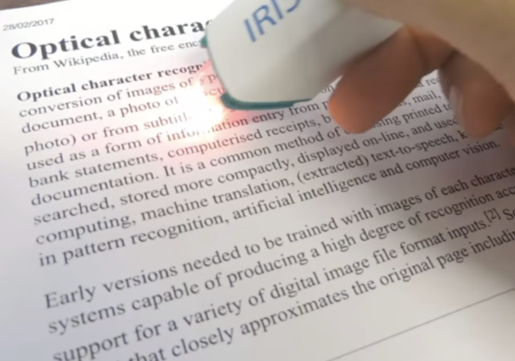
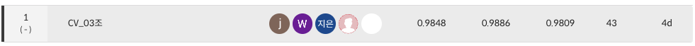
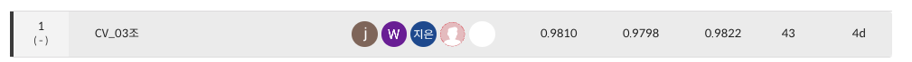

# 🔡 OCR Data-Centric 대회

## ✨ 팀 소개

Thanks goes to these wonderful people ([emoji key](https://allcontributors.org/docs/en/emoji-key)):

<table>
<tr>
<td align="center"><a href="https://github.com/seungki1011"><br /><sub><b>김승기</b></sub><br />
<a href="https://github.com/boostcampaitech5/level2_cv_datacentric-cv-03/commits?author=seungki1011" title="Code">💻</a>
<a href="https://github.com/boostcampaitech5/level2_cv_datacentric-cv-03/tree/master/utils" title="Tool">🔧</a>
<a href="https://github.com/boostcampaitech5/level2_cv_datacentric-cv-03/issues" title="Bug">🐛</a>
<a href="https://github.com/boostcampaitech5/level2_cv_datacentric-cv-03/pulls?q=is%3Apr+is%3Aclosed" title="Review">👀</a>
</td>
<td align="center"><a href="https://github.com/jjjuuuun"><br /><sub><b>김준영</b></sub></a><br />
<a href="https://github.com/boostcampaitech5/level2_cv_datacentric-cv-03/commits?author=jjjuuuun" title="Code">💻</a>
<a href="https://github.com/boostcampaitech5/level2_cv_datacentric-cv-03/issues" title="Bug">🐛</a>
<a href="https://github.com/boostcampaitech5/level2_cv_datacentric-cv-03" title="Data">🔣</a>
<a href="https://github.com/boostcampaitech5/level2_cv_datacentric-cv-03" title="projectManagement">📆</a>
</td>
<td align="center"><a href="https://github.com/helpmeIamnewbie"><br /><sub><b>전형우</b></sub></a><br />
<a href="https://github.com/boostcampaitech5/level2_cv_datacentric-cv-03/commits?author=helpmeIamnewbie" title="Code">💻</a>
<a href="https://github.com/boostcampaitech5/level2_cv_datacentric-cv-03" title="Data">🔣</a>
<a href="https://github.com/boostcampaitech5/level2_cv_datacentric-cv-03/pulls?q=is%3Apr+is%3Aclosed" title="Research">🔬</a>
<a href="https://github.com/boostcampaitech5/level2_cv_datacentric-cv-03/tree/master/utils" title="Tool">🔧</a>
</td>
<td align="center"><a href="https://github.com/CheonJiEun"><br /><sub><b>천지은</b></sub></a><br />
<a href="https://github.com/boostcampaitech5/level2_cv_datacentric-cv-03/commits?author=CheonJiEun" title="Code">💻</a>
<a href="https://github.com/boostcampaitech5/level2_cv_datacentric-cv-03" title="Data">🔣</a>
<a href="https://github.com/boostcampaitech5/level2_cv_datacentric-cv-03" title="Ideas">🤔</a>
<a href="https://github.com/boostcampaitech5/level2_objectdetection-cv-03/pulls?q=" title="Research">🔬</a>
</td>
<td align="center"><a href="https://github.com/Eyecaramba"><br /><sub><b>신우진</b></sub></a><br />
<a href="https://github.com/boostcampaitech5/level2_cv_datacentric-cv-03/commits?author=Eyecaramba" title="Code">💻</a>
<a href="https://github.com/boostcampaitech5/level2_cv_datacentric-cv-03" title="Data">🔣</a>
<a href="https://github.com/boostcampaitech5/level2_cv_datacentric-cv-03/issues" title="Bug">🐛</a>
<a href="https://github.com/boostcampaitech5/level2_cv_datacentric-cv-03/pulls?q=is%3Apr+is%3Aclosed" title="Review">👀</a>
</td>
</tr>
</table>

This project follows the [all-contributors](https://github.com/all-contributors/all-contributors) specification. Contributions of any kind welcome!

## 🎙️ 프로젝트 소개

<p align="center">

</p>

OCR (Optimal Character Recognition) 기술은 사람이 직접 쓰거나 이미지 속에 있는 문자를 얻은 다음 이를 컴퓨터가 인식할 수 있도록 하는 기술입니다. 스마트폰으로 카드를 결제하거나, 카메라로 카드를 인식할 경우 자동으로 카드 번호가 입력되거나 주차장에 들어가면 차량 번호가 자동으로 인식되는 등 일상생활에 이미 보편적으로 사용되고 있습니다. 이번 대회는 OCR의 대표적인 model 중 하나인 EAST model을 활용하여 진료비 계산서 영수증안에 있는 글자를 인식하는 대회입니다. 

이번 대회는  Data-Centric 대회로 다음과 같은 제약사항이 있습니다. 

- 대회에서 주어지는 EAST model만을 사용해야 하며 model과 관련된 코드를 바꿔서는 안됩니다.
- 이미지넷 기학습 가중치 외에는 사용이 불가합니다.

즉 이번 대회는 모델을 고정한 상태로 데이터만을 활용하여 OCR model의 성능을 최대한 끌어 올리는 프로젝트 입니다. 

이번 대회는 `부스트캠프 AI Tech` CV 트랙내에서 진행된 대회이며 F1-Score로 최종평가를 진행하였습니다. 

## 📆 프로젝트 일정

프로젝트 전체 일정

- 2023.05.22 ~ 2023.06.01

프로젝트 세부 일정

- 2023.05.22 ~ 2023.05.24 : OCR에 대해 알아보기, EDA
- 2023.05.25 ~ 2023.05.25 : Train dataset과 Validation dataset 분리, Validation 코드 추가
- 2023.05.26 ~ 2023.05.28 : Mixed Precision, Pickle 파일로 학습시간 단축
- 2023.05.27 ~ 2023.05.28 : Train/Test dataset 살펴보기, Re-labeling, Augmentation 실험
- 2023.05.29 ~ 2023.05.31 : Re-labeling, Pretrain용 Dataset 탐색, wandb에 detEval 추가
- 2023.05.30 ~ 2023.05.31 : Re-labeling, Optimizer & Scheduler 탐색
- 2023.06.01 ~ 2023.06.01 : Ensemble

## 🥼 프로젝트 수행

➡️ Link따라 들어가시면 보실 수 있습니다.

1. [EDA](https://jjjuuuun.notion.site/EDA-076e97e382a2442aa041048f1ee0950c?pvs=4) 
2. [Inferecne 분석 및 문제점 분석](https://jjjuuuun.notion.site/INFERENCE-e7827bc54b874372bc203a051e069ce5?pvs=4) 
3. [Re-labeling](https://jjjuuuun.notion.site/Re-labeling-0f20a80e90fd423f836c7a213f653721?pvs=4)
4. [Labeling Guidelines](https://jjjuuuun.notion.site/eb0db0b4d555417aafb7e116379b4447?pvs=4)
5. [외부 데이터셋](https://jjjuuuun.notion.site/0d51b19cba3f47de81e0991caef79dd5?pvs=4) 
6. [최종 발표자료](etc/presentation.pdf) 

## 🗒️ 프로젝트 결과

- 프로젝트 결과 최종적으로 아래와 같은 결과를 얻었습니다. (Public 1등, Private 1등)
    - Public
    
    
    
    - Private
    
    
    

# 🔄️ Directory

```
├── utils
├── .gitignore
├── gitcommit_template.txt
├── dataset.py
├── inference.py
├── train.py
└── train_fp16.py
```
- 베이스라인 모델인 EAST 모델이 정의되어 있는 `model.py`, `loss.py`, `east_dataset.py`, `detect.py` 파일은 변경하지 않았으므로 업로드하지 않았습니다.
- 실험의 결과를 확인하기 위한 기능들, 성능을 더 올리기 위한 기능들은 `utils`폴더 안에 모두 구성했습니다.
    
    
    | File(.ipynb/.py) | Description |
    | --- | --- |
    | COCO to UFO | COCO format으로 작성된 json file을 UFO format으로 변환합니다. |
    | UFO to COCO | UFO format으로 작성된 json file을 COCO format으로 변환합니다.  |
    | Erase exclude tags and Polygons  | 필요없는 tag와 polygon을 지웁니다.  |
    | check | Image에 대해 bbox가 어떻게 그려지는지 확인해보는 코드입니다.  |
    | preprocessing | 학습 가속화를 위해 image 데이터를 pickle로 바꿉니다.  |
    | speed_up_loader | Image를 pickle로 변경한 후 데이터 로딩 시간의 변화를 정리한 파일입니다.  |
    | train_val_split | Train dataset과 Validation dataset으로 나눕니다.  |
    | ensemble | WBF ensemble 코드입니다.  |
    | wbf_ensemble | 기존 라이브러리 코드에서 하나의 모델만 예측한 bbox를 제거하는 코드를 추가한 ensemble 코드입니다.  |

# 🤔 Wrap-Up Report

- [Wrap-Up Report](etc/wrap_up_report.pdf)

# ⚠️ Dataset 출처

- 대회에서 사용된  `부스트캠프 AI Tech`임을 알려드립니다.
